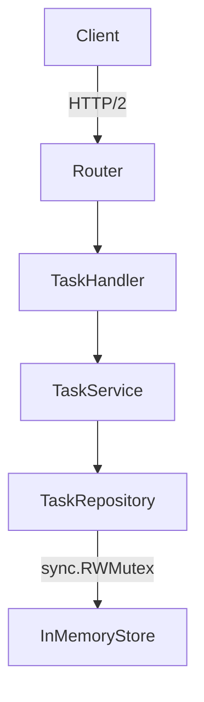
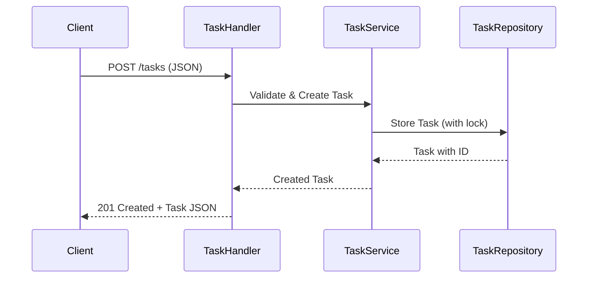
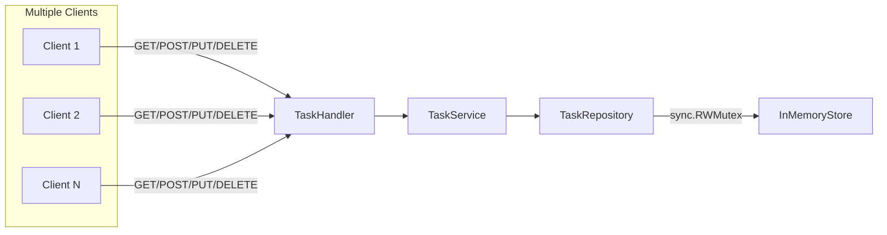

# Design Document: Task Management API in Go

This document provides a comprehensive technical design for implementing the Task Management API as specified in `task-management-api.spec.md`. The design emphasizes idiomatic Go, SOLID principles, thread-safety, and maintainability.

---

## Table of Contents

1. [System Overview](#system-overview)
2. [Project Structure](#project-structure)
3. [Data Model](#data-model)
4. [Component Breakdown](#component-breakdown)
5. [API Endpoints](#api-endpoints)
6. [Business Logic & Validation](#business-logic--validation)
7. [Concurrency & Thread Safety](#concurrency--thread-safety)
8. [Error Handling](#error-handling)
9. [Testing Strategy](#testing-strategy)
10. [Diagrams](#diagrams)

---

## 1. System Overview

A RESTful HTTP/2 API for managing tasks in-memory, supporting CRUD operations, concurrent access, and robust error handling. The system is designed for extensibility and clarity, following idiomatic Go and SOLID principles.

---

## 2. Project Structure

```
/cmd/server/          - Application entry point (main.go)
/internal/handler/    - HTTP handlers (private to app)
/internal/service/    - Business logic (private)
/internal/repository/ - Data access layer (private)
/internal/model/      - Data models (private)
/internal/config/     - Configuration (private)
/pkg/                 - Public packages (if any)
```

---

## 3. Data Model

### Task Statusp

```go
type TaskStatus string

const (
    StatusPending    TaskStatus = "pending"
    StatusInProgress TaskStatus = "in-progress"
    StatusCompleted  TaskStatus = "completed"
)
```

### Task Structure

```go
type Task struct {
    ID          string     `json:"id"`
    Title       string     `json:"title"`
    Description string     `json:"description,omitempty"`
    Status      TaskStatus `json:"status"`
    CreatedAt   time.Time  `json:"created_at"`
    UpdatedAt   time.Time  `json:"updated_at"`
}
```

- **ID**: UUID (auto-generated)
- **Title**: Required, 1-200 chars
- **Description**: Optional, max 1000 chars
- **Status**: `TaskStatus` (must be one of the defined constants)
- **Timestamps**: ISO 8601

---

## 4. Component Breakdown

### 4.1 HTTP Handlers (`/internal/handler/`)

- `TaskHandler`: Handles all /tasks endpoints

### 4.2 Service Layer (`/internal/service/`)

- `TaskService`: Business logic for CRUD, validation, status transitions

### 4.3 Repository Layer (`/internal/repository/`)

- `TaskRepository`: In-memory store, thread-safe, implements storage interface

### 4.4 Model Layer (`/internal/model/`)

- `Task`: Data structure and validation

### 4.5 Config & Logging

- `/internal/config/`: App config (if needed)
- Logging: Use `go.uber.org/zap` in all layers

---

## 5. API Endpoints

| Method | Path         | Description                | Request Body         | Response Body         | Status Codes         |
|--------|--------------|----------------------------|----------------------|-----------------------|----------------------|
| POST   | /tasks       | Create a new task          | Task (no ID/timestamps) | Task (with ID/timestamps) | 201, 400            |
| GET    | /tasks       | List all tasks             | -                    | []Task                | 200                  |
| GET    | /tasks/{id}  | Get task by ID             | -                    | Task                  | 200, 404             |
| PUT    | /tasks/{id}  | Update task (full/partial) | Partial/Full Task    | Task                  | 200, 400, 404        |
| DELETE | /tasks/{id}  | Delete task                | -                    | -                     | 204, 404             |

---

## 6. Business Logic & Validation

- **Task Creation**: Validate required fields, generate UUID, set timestamps
- **Task Update**: Allow partial updates, update `updated_at`, validate status transitions
- **Task Deletion**: Remove by ID, handle not found
- **Validation**: Hand-rolled, per spec (title, description, status). Status must match one of the `TaskStatus` constants; reject any other value.
- **Error Handling**: Return structured error responses with code, message, timestamp

---

## 7. Concurrency & Thread Safety

- Use `sync.RWMutex` in `TaskRepository` for all access
- All CRUD operations must acquire appropriate locks
- No nested locks; minimize lock duration
- Ensure atomicity for multi-step operations

---

## 8. Error Handling

- Use idiomatic Go error values
- Map errors to HTTP status codes
- Structured error response:

  ```json
  {
    "error": {
      "code": "TASK_NOT_FOUND",
      "message": "Task not found",
      "timestamp": "2025-07-29T12:00:00Z"
    }
  }
  ```

- Log all errors with zap

---

## 9. Testing Strategy

- Unit tests for all handlers, services, repositories
- Use `testing` and `github.com/stretchr/testify`
- Concurrency tests for repository
- Integration tests for API endpoints
- Place all `*_test.go` files alongside code

---

## 10. Diagrams

### 10.1 Architecture Overview



### 10.2 Data Flow: Create Task



### 10.3 Data Flow: Concurrent Access



---

## 11. Extensibility & SOLID Mapping

- **SRP**: Handlers, services, repositories, and models are separated
- **OCP**: Storage backend is interface-based; new backends can be added
- **LSP**: All storage implementations must conform to interface
- **ISP**: Separate interfaces for read/write if needed
- **DIP**: All dependencies injected via constructors

---

## 12. Implementation Notes

- Use Go modules, `gofmt`, and `staticcheck`
- All exported types/functions have Go doc comments
- Use `github.com/google/uuid` for IDs
- Use `go.uber.org/zap` for logging
- Use only standard library and approved community packages

---

This design document is a single source of truth for implementing the Task Management API as per the provided specification.
