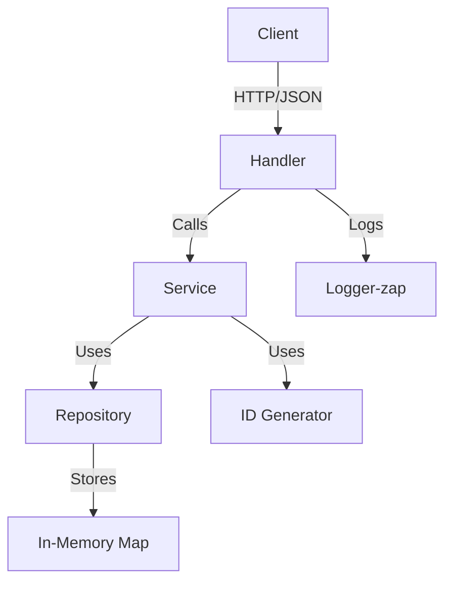
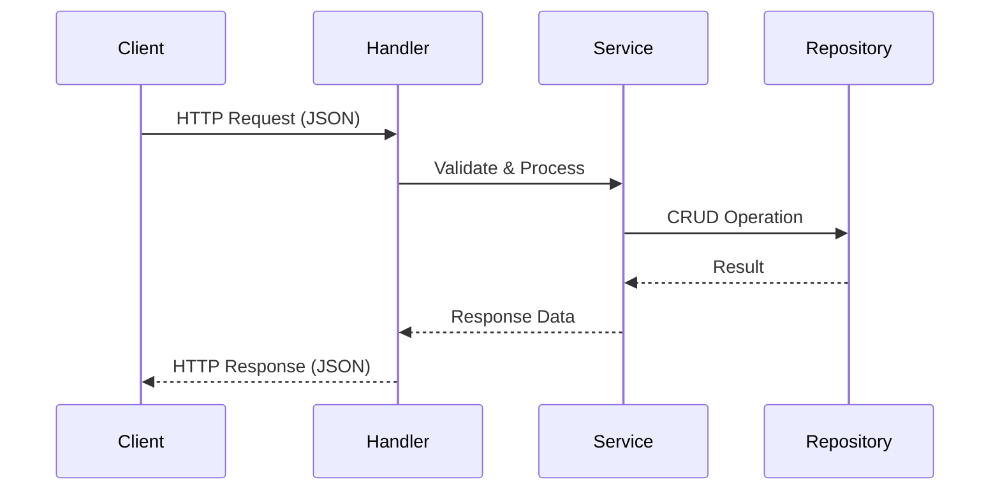

# Task Manager API

A simple, modular, and testable RESTful API for managing tasks, written in Go. This project demonstrates clean architecture, in-memory storage, and includes a demo script for API usage.

## Features

- RESTful API for CRUD operations on tasks
- In-memory repository (no external DB required)
- Modular architecture (handler, service, repository, model)
- Graceful shutdown and logging (zap)
- Demo script for API usage
- Comprehensive unit and integration tests

## Architecture



## Data Flow



## Getting Started

### Prerequisites

- Go 1.20+
- [Tilt](https://tilt.dev/) (for local Kubernetes dev)
- [kubectl](https://kubernetes.io/docs/tasks/tools/)
- Docker (for image builds and as a container runtime)
- A local Kubernetes cluster (e.g. Docker Desktop, minikube, or [Colima](https://github.com/abiosoft/colima))
- `jq` (for demo script)

### Local Development with Tilt & Kubernetes

Start your local Kubernetes cluster (e.g. Docker Desktop, minikube, or Colima with `colima start --kubernetes`).

#### Tilt Make Targets

You can use Makefile targets for common Tilt workflows:

- `make tilt-up` — start Tilt for local development
- `make tilt-down` — stop Tilt and clean up
- `make tilt-ci` — run Tilt in CI/headless mode

This will build the image, apply manifests from `deploy/`, and port-forward to [localhost:8080](http://localhost:8080).

### Build & Run (Standalone)

```sh
make build
./bin/taskmanager
```

Or run directly:

```sh
go run ./cmd/server
```

### API Endpoints

- `GET    /`              - Service info `{ "service": "taskmanager" }`
- `GET    /healthz`       - Health check `{ "ok": true }`
- `GET    /tasks`         - List all tasks
- `POST   /tasks`         - Create a new task
- `GET    /tasks/{id}`    - Get a task by ID
- `PUT    /tasks/{id}`    - Update a task by ID
- `DELETE /tasks/{id}`    - Delete a task by ID

#### Task JSON Example

```json
{
  "id": "string (auto-generated if omitted)",
  "title": "Task title",
  "description": "Optional description",
  "completed": false
}
```

### Demo Script

Run the provided demo script to see the API in action:

```sh
bash demo_tasks.sh
```

### Docker

Build and scan the image:

```sh
docker build -t taskmanager:dev .
trivy image taskmanager:dev
```

### Kubernetes Manifests

Kubernetes manifests are in `deploy/`:

- `deploy/deployment.yaml` (with liveness/readiness probes)
- `deploy/service.yaml`

Apply to any cluster:

```sh
kubectl apply -f deploy/
```

## Testing

Run all tests:

```sh
make test
```

Or:

```sh
go test ./...
```

## Project Structure

- Main entry: `cmd/server/main.go`
- Handlers: `internal/handler/`
- Services: `internal/service/`
- Repository: `internal/repository/`
- Models: `internal/model/`
- Kubernetes: `deploy/`
- Docker ignore: `.dockerignore`
- Tiltfile: `Tiltfile`
